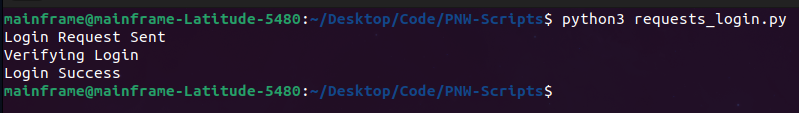

# PNW Auto Login
For the online video game Politics and War

Link: https://politicsandwar.com/ 
## How to Use
**Example of Manual Use**

- **Download or Git Clone Repo**
- **Enter credentials or profile PATH inside .env file**
- **Place preferred script in startup**
- ## For Windows
- **Place either "requests_login.py" or "selenium_login.py" in Windows startup folder**
  
  **How to get to startup folder:**
   - Step 1: Open the Run command box by simultaneously pressing the Windows logo and R keys.
   - Step 2: In the Run command box, type Shell:Startup and then hit the Enter key to open the Startup folder.
   - Note that this Startup folder is for the currently logged-in user only.
     If you want to open the Startup folder for all users, type Shell:Common Startup and hit the Enter key.

- ## For Ubuntu
  - Press the Windows key and type "Startup" in the search bar, you will find the "Startup Applications" app
  - Click and enter the command name and command path (Path to your script)
    
## Notes 
- I recommend using "requests_login.py" - completes login in seconds and only requires email and password
- Using Selenium script is good if you're already logged in
- To use Selenium Firefox is required, as that is the browser I prefer and made this script for.

